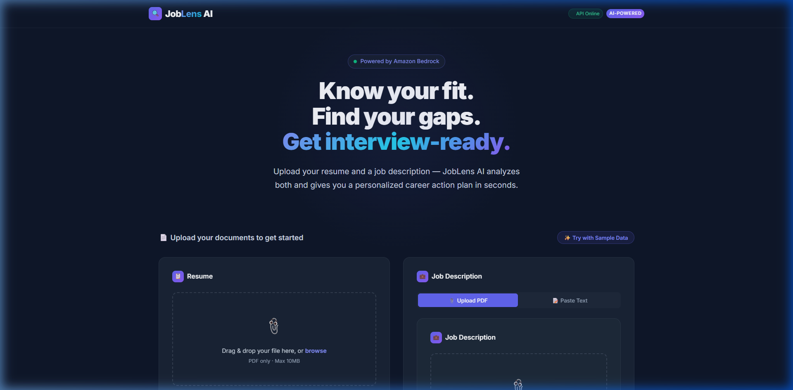
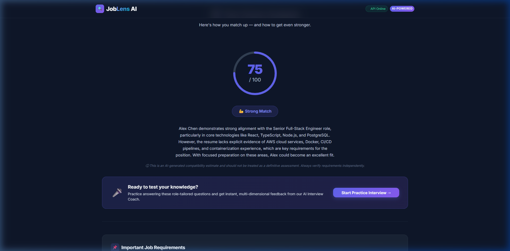
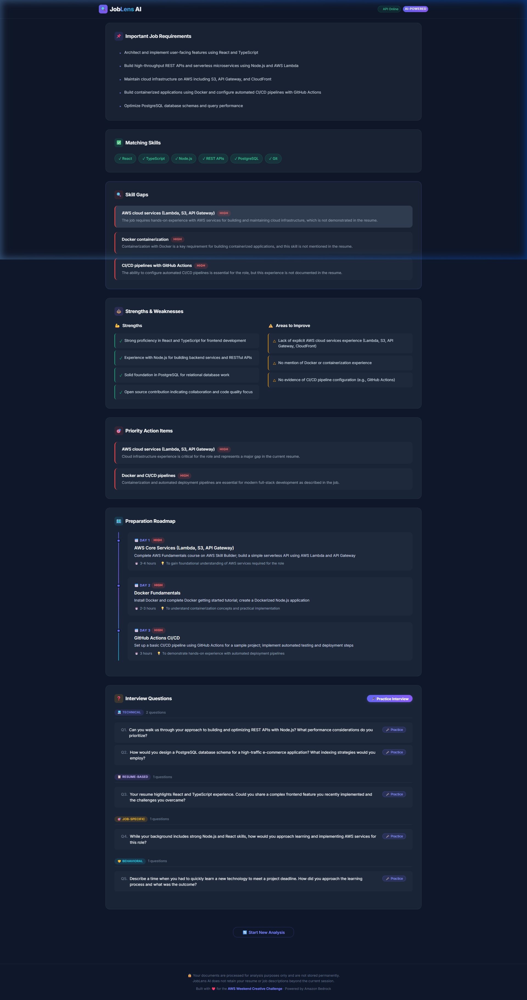
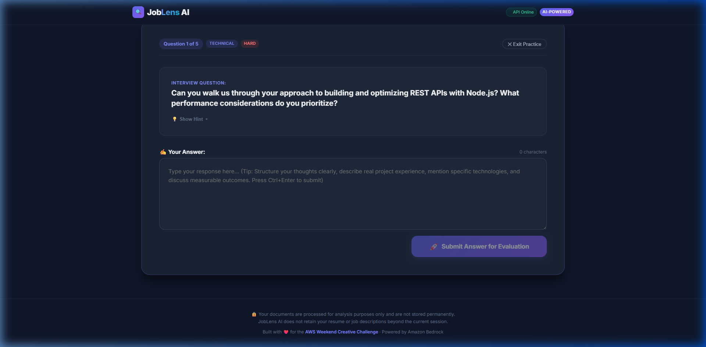
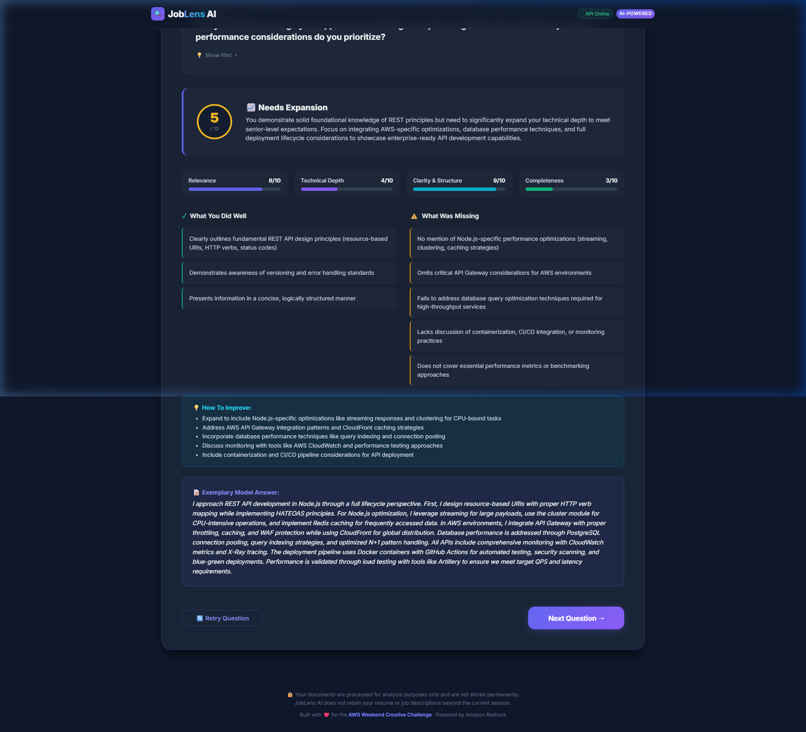
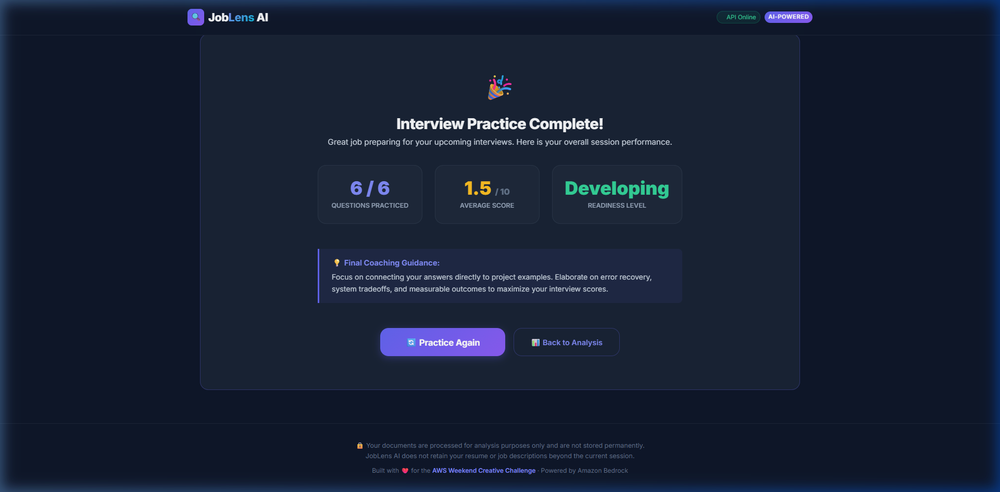

# JobLens AI

## From Resume to Interview-Ready

> *"The goal isn't simply to tell candidates where they stand. It's to show them what to do next."*

JobLens AI is an AI-powered career intelligence and interview preparation platform that analyzes a candidate's resume against a target job description, identifies evidence-based skill gaps, generates a personalized five-day preparation roadmap, creates role-specific interview questions, and provides real-time AI interview coaching with multi-dimensional scoring and exemplary model answers.

---

## Live Links

- **Live Application**: [https://main.d1bpyz33rz20e0.amplifyapp.com](https://main.d1bpyz33rz20e0.amplifyapp.com)
- **GitHub Repository**: [https://github.com/deepakrajjs-29/JobLensAI](https://github.com/deepakrajjs-29/JobLensAI)
- **Amazon API Gateway Endpoint**: [https://f31wzguidd.execute-api.us-east-1.amazonaws.com](https://f31wzguidd.execute-api.us-east-1.amazonaws.com)
- **Backend Health Check**: [https://f31wzguidd.execute-api.us-east-1.amazonaws.com/api/health](https://f31wzguidd.execute-api.us-east-1.amazonaws.com/api/health)

---

## Product Screenshots

### 1. Document Ingestion & Matching Interface
Candidates upload their resume in PDF format and supply a target job description via PDF upload or text input. A one-click sample data loader is available for instant demonstration.



---

### 2. Evidence-Based Career Analysis Dashboard
Amazon Bedrock analyzes candidate alignment against target job requirements, producing a compatibility score, executive summary, and live foundation model metadata badge.



---

### 3. Prioritized Skill Gaps & 5-Day Roadmap
Identifies explicit matching skills and highlights missing requirements with priority ratings (`high`, `medium`, `low`) alongside an actionable, day-by-day learning action plan.



---

### 4. Interactive AI Interview Coach Studio
Candidates practice answering role-tailored questions categorized by type (Technical, Behavioral, Resume-Based, Job-Specific) with difficulty indicators and live character counters.



---

### 5. Multi-Dimensional Scoring & Model Answers
Amazon Nova 2 Lite evaluates responses across four rubric dimensions (Relevance, Technical Depth, Clarity, Completeness) on a 0–10 scale, offering actionable tips and exemplary senior-level model answers.



---

### 6. Interview Readiness Summary
Upon completing practice questions, candidates receive an aggregate performance breakdown with average score, readiness classification, and final coaching guidance.



---

## Architecture


### End-to-End Request & Data Flow

#### Flow 1: Document Processing & Career Analysis (`POST /api/analyze`)
```text
User Browser ──(Resume PDF + Job Description)──> AWS Amplify ──(HTTPS)──> Amazon API Gateway
                                                                                 │
                                                                                 ▼ (Payload v2)
React Results Dashboard <──(Pydantic Schema)── Amazon Bedrock <──(Converse API)── AWS Lambda (FastAPI + pypdf)
                                              (Nova 2 Lite)
```
1. The user uploads a resume PDF and job description to the React frontend hosted on **AWS Amplify**.
2. The payload is sent via HTTPS to **Amazon API Gateway** (HTTP API proxy route `ANY /{proxy+}`).
3. **AWS Lambda** executes the **FastAPI** backend via the **Mangum** ASGI adapter.
4. `pypdf` extracts document text in memory without writing files to disk.
5. The backend constructs an evidence-based prompt and invokes **Amazon Bedrock** (`us.amazon.nova-2-lite-v1:0` in `us-east-1`) via the unified Converse API.
6. The structured JSON response is validated with **Pydantic** and rendered on the client dashboard.

#### Flow 2: AI Interview Answer Evaluation (`POST /api/interview/evaluate`)
```text
Candidate Answer ──(JSON Payload)──> API Gateway ──> AWS Lambda ──> Bedrock Nova 2 Lite
                                                                           │
Interview Coach UI <──(Score + Feedback + Model Answer)── Pydantic Schema ─┘
```
1. The candidate submits their answer to a question within the Interview Coach studio.
2. FastAPI passes the question, role context, and answer to Amazon Nova 2 Lite.
3. The model scores the response on a 0–10 scale across Relevance, Technical Depth, Clarity, and Completeness.
4. Detailed feedback cards (Strengths, Missing Points, Improvement Tips, Exemplary Model Answer) are validated and rendered immediately.

### Security Architecture

```text
AWS Amplify (Public Frontend SPA)
       │ (HTTPS / No AWS Credentials in Client)
       ▼
Amazon API Gateway (HTTP API Router)
       │ (Payload v2)
       ▼
AWS Lambda (Serverless Compute)
       │ (IAM Execution Role: bedrock:InvokeModel)
       ▼
Amazon Bedrock (Nova 2 Lite Inference Profile)
```

- **Zero Client Credentials**: No AWS access keys, secret keys, or temporary session tokens are stored in the client or committed to Git.
- **IAM Role Security**: Lambda authenticates to Amazon Bedrock using its attached **IAM Execution Role** with least-privilege `bedrock:InvokeModel` permissions.
- **In-Memory Processing**: Resumes and job descriptions are parsed in memory using byte streams and discarded immediately after inference.

For full architectural details, see [docs/architecture.md](docs/architecture.md).

---

## Core Features

### Resume and Job Analysis
- In-memory PDF text extraction using `pypdf`.
- Dual-mode job description ingestion (PDF upload or pasted text).
- Objective compatibility scoring (0 to 100).
- Evidence-based matching against explicit job requirements.

### Career Intelligence & Planning
- Direct matching skill verification.
- Prioritized skill gap identification (`high`, `medium`, `low`) with concrete rationale.
- Core strengths and areas for growth.
- Actionable, personalized five-day preparation roadmap with estimated effort.

### AI Interview Coach
- Categorized question generation (Technical, Resume-Based, Behavioral, Job-Specific).
- Difficulty ratings (Easy, Medium, Hard) and answering hints.
- Interactive response studio with character counter and keyboard shortcuts (`Ctrl+Enter`).
- Objective 0–10 score evaluation with 4-bar metric breakdown:
  - **Relevance**: Directness in addressing prompt criteria.
  - **Technical Depth**: Accuracy, architectural patterns, and depth.
  - **Clarity & Structure**: Flow, conciseness, and communication framework.
  - **Completeness**: Coverage of tradeoffs, edge cases, and real-world results.
- Concrete improvement tips and exemplary senior-level model answers.
- Session completion summary with aggregate performance metrics.

---

## AWS Services Used

### Amazon Bedrock
- **Role**: Powers core career analysis, question generation, and real-time interview answer evaluation.
- **Model**: **Amazon Nova 2 Lite**
- **Inference Profile**: `us.amazon.nova-2-lite-v1:0`
- **Region**: `us-east-1`
- **API**: Boto3 unified Converse API (`client.converse`).

### AWS Lambda
- **Role**: Serverless execution of the Python FastAPI application via the **Mangum** ASGI adapter.
- **Runtime**: Python 3.12 (Linux x86_64).
- **Security**: Accesses Amazon Bedrock directly through its IAM Execution Role (`bedrock:InvokeModel`). No AWS credentials or secret keys are stored in the frontend or application source code.

### Amazon API Gateway
- **Role**: Exposes a secure, public HTTPS endpoint routing traffic to AWS Lambda with configurable CORS.

### AWS Amplify
- **Role**: Hosts and builds the React 19 + TypeScript single-page application with automated continuous deployment from GitHub.

---

## Project Structure

```text
JobLensAI/
│
├── backend/
│   ├── app/
│   │   ├── models/
│   │   │   └── schemas.py             # Pydantic data schemas
│   │   ├── routes/
│   │   │   ├── analysis.py            # /api/health and /api/analyze endpoints
│   │   │   └── interview.py           # /api/interview/evaluate endpoint
│   │   ├── services/
│   │   │   ├── bedrock_service.py     # Amazon Bedrock Converse API service
│   │   │   └── document_parser.py     # In-memory PDF text extractor (pypdf)
│   │   ├── utils/
│   │   │   └── text_cleaner.py        # Text formatting & bullet point cleaner
│   │   └── main.py                    # FastAPI entrypoint with CORS
│   ├── build_lambda_package.py        # Packaging script for Linux x86_64 Lambda ZIP
│   ├── lambda_handler.py              # AWS Lambda Mangum entrypoint
│   ├── requirements.txt               # Backend dependencies
│   ├── test_backend.py                # Automated backend test suite (12 tests)
│   └── test_bedrock_live.py           # Standalone Bedrock connectivity test
│
├── frontend/
│   ├── src/
│   │   ├── components/                # Modular UI components
│   │   │   ├── Header.tsx             # Navigation header with live status
│   │   │   ├── Hero.tsx               # Value proposition hero
│   │   │   ├── UploadSection.tsx      # Dual-card drag-and-drop uploader
│   │   │   ├── MatchScore.tsx         # Circular SVG score ring
│   │   │   ├── ResultsDashboard.tsx   # Analysis results view
│   │   │   ├── InterviewCoach.tsx     # Interactive interview practice studio
│   │   │   └── ...
│   │   ├── services/
│   │   │   └── api.ts                 # Centralized API client (VITE_API_BASE_URL)
│   │   ├── types/
│   │   │   └── analysis.ts            # TypeScript data interfaces
│   │   ├── App.tsx                    # Main application controller
│   │   └── App.css                    # Glassmorphism dark-theme CSS
│   ├── .env.example                   # Frontend environment template
│   └── package.json                   # React 19 + Vite dependencies
│
├── docs/
│   ├── architecture.md                # System architecture documentation
│   ├── architecture.png               # High-resolution AWS architecture diagram
│   ├── api.md                         # API endpoint documentation
│   ├── article-visual-plan.md         # AWS Builder Center publication visual plan
│   └── images/                        # Application screenshots
│       ├── 01-homepage.png
│       ├── 02-resume-analysis.png
│       ├── 03-skill-gaps.png
│       ├── 04-interview-coach.png
│       ├── 05-interview-feedback.png
│       └── 06-readiness-summary.png
│
├── amplify.yml                        # AWS Amplify build specification
├── DEPLOYMENT_GUIDE.md                # Step-by-step deployment guide
├── .gitignore                         # Comprehensive Git exclusion rules
└── README.md                          # Root project documentation
```

---

## Local Development Setup

### Prerequisites
- Python 3.10+ / 3.12
- Node.js 18+ and npm
- AWS CLI configured (for Amazon Bedrock access during live analysis)

### 1. Backend Setup

```powershell
# Navigate to backend directory
cd backend

# Create and activate virtual environment
python -m venv .venv
.\.venv\Scripts\Activate.ps1   # On macOS/Linux: source .venv/bin/activate

# Install dependencies
pip install -r requirements.txt

# Start FastAPI development server
uvicorn app.main:app --reload --port 8000
```

The backend will be running at `http://127.0.0.1:8000` (Interactive Swagger docs: `http://127.0.0.1:8000/docs`).

### 2. Frontend Setup

In a separate terminal:

```powershell
# Navigate to frontend directory
cd frontend

# Install dependencies
npm install

# Start Vite development server
npm run dev
```

The frontend will be running at `http://localhost:5173`.

---

## Environment Configuration

### Frontend (`frontend/.env.example`)
```bash
# In local development: defaults to http://127.0.0.1:8000
# In production: set to your Amazon API Gateway HTTP API endpoint
VITE_API_BASE_URL=http://127.0.0.1:8000
```

### Backend (`backend/.env.example`)
```bash
# AWS Bedrock configuration
AWS_REGION=us-east-1
BEDROCK_MODEL_ID=us.amazon.nova-2-lite-v1:0
ALLOWED_ORIGINS=http://localhost:5173,http://127.0.0.1:5173
```

*Note: In production, AWS Lambda reads configuration directly from Lambda Environment Variables and IAM Roles without using local `.env` files.*

---

## Testing & Verification

The project includes an automated test suite verifying data parsers, schema validation, prompt builders, endpoints, and the Lambda Mangum adapter.

### Run Backend Tests
```powershell
cd backend
python test_backend.py
```

**Verified Test Suite (12/12 Tests Passing):**
- `test_text_cleaner`: Whitespace and bullet normalization.
- `test_health_endpoint`: `GET /api/health` status and Bedrock detection.
- `test_bedrock_prompts`: System and user prompt formatting.
- `test_json_extraction_from_markdown`: JSON extraction and code fence stripping.
- `test_bedrock_schema_validation`: Strict validation against `AnalysisResultSchema`.
- `test_analyze_endpoint_e2e_mocked_bedrock`: Complete `/api/analyze` request/response flow.
- `test_interview_evaluation_schema_validation`: Strict validation against `InterviewEvaluationSchema`.
- `test_interview_prompts`: Interview coaching prompt construction.
- `test_interview_evaluate_endpoint_mocked`: Complete `/api/interview/evaluate` flow.
- `test_interview_evaluate_short_answer_validation`: Input validation (<10 chars rejected).
- `test_fallback_interview_evaluation_generator`: Dynamic fallback evaluation engine.
- `test_mangum_lambda_handler`: AWS Lambda execution using simulated API Gateway v2 events.

### Run Frontend Production Build
```powershell
cd frontend
npm run build
```
**Result**: 0 TypeScript compilation errors; production build compiled cleanly to `frontend/dist/`.

---

## Security & Privacy

- **Zero Credential Exposure**: No AWS access keys, secret keys, or temporary session tokens are stored in the client application or committed to Git.
- **IAM Role Security**: In AWS Lambda, Boto3 utilizes the least-privilege IAM Execution Role for Amazon Bedrock invocation.
- **In-Memory Document Processing**: Uploaded PDF files are parsed directly in memory via `io.BytesIO` streams and immediately discarded after processing. No documents are written to permanent disk storage.
- **Strict Input Validation**: Files are restricted to 10MB; answers and questions undergo length checks and input sanitization on both frontend and backend.

---

## Responsible AI Considerations

JobLens AI is designed strictly as a **career preparation and guidance tool**, not an automated hiring or decision-making system.

- **Evidence-Based Evaluation**: The system evaluates candidate alignment based exclusively on documented skills and experiences in the provided resume, distinguishing clearly between *"confirmed skills"* and *"skills not evidenced in document"*.
- **Fairness & Non-Discrimination**: Prompts explicitly forbid the foundation model from considering or penalizing protected demographic characteristics (gender, race, age, religion, nationality, disability).
- **Constructive Feedback**: Feedback focuses on actionable learning items, architectural tradeoffs, and communication frameworks to empower candidate career growth.

---

## Development Journey

- **Phase 1 — Frontend Foundation**: React 19 + TypeScript single-page application with dark glassmorphism design system, drag-and-drop document upload, and responsive layout.
- **Phase 2 — Document Processing & Backend**: Python FastAPI backend with in-memory PDF extraction (`pypdf`), text cleaner, and structured Pydantic schemas.
- **Phase 3 — Amazon Bedrock AI Analysis**: Integration with **Amazon Nova 2 Lite** (`us.amazon.nova-2-lite-v1:0`) via the unified Boto3 Converse API for evidence-based career intelligence and gap analysis.
- **Phase 4 — AI Interview Coach**: Real-time interview practice studio with multi-dimensional 0–10 scoring rubric, actionable feedback cards, and exemplary model answers.
- **Phase 5 — AWS Serverless Deployment**: Serverless production architecture deploying the backend to **AWS Lambda** via **Mangum** and **Amazon API Gateway**, and hosting the frontend on **AWS Amplify**.

---

## Challenges & Solutions

1. **Deterministic Structured JSON Output**:
   - *Challenge*: Foundation models occasionally wrap JSON in explanatory text or markdown code blocks.
   - *Solution*: Implemented a robust regex-based JSON extractor (`extract_json_from_response`) coupled with Pydantic schema validation and fallback error boundaries.
2. **Cross-Platform Lambda Packaging**:
   - *Challenge*: Developing on Windows while targeting a Linux x86_64 Lambda runtime created binary compatibility challenges for compiled libraries like `pydantic-core`.
   - *Solution*: Developed `build_lambda_package.py` leveraging pip's `--platform manylinux2014_x86_64` flag to bundle true Linux wheels without requiring a local Linux virtual machine.
3. **Seamless Local vs. Production API Routing**:
   - *Challenge*: Avoiding hardcoded URLs across development and serverless environments.
   - *Solution*: Implemented dynamic `VITE_API_BASE_URL` resolution with trailing-slash sanitization in the frontend and configurable `ALLOWED_ORIGINS` in FastAPI.

---

## License

This project is currently unlicensed. All rights reserved.
