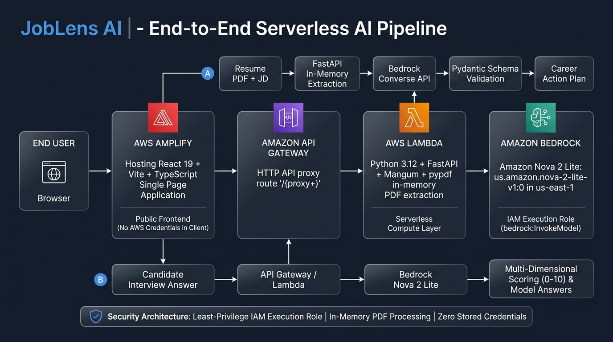

# JobLens AI — System Architecture

This document provides a comprehensive technical overview of the **JobLens AI** cloud architecture, data pipelines, compute layers, and security mechanisms.

---

## 1. End-to-End Architecture Overview



```text
                                  User Browser
                                       │
                                       ▼ HTTPS
                             ┌───────────────────┐
                             │    AWS Amplify    │  (React 19 + TypeScript SPA)
                             └─────────┬─────────┘
                                       │
                                       ▼ HTTPS (VITE_API_BASE_URL)
                             ┌───────────────────┐
                             │ Amazon API Gateway│  (HTTP API - Proxy Router)
                             └─────────┬─────────┘
                                       │
                                       ▼ (Payload v2)
                             ┌───────────────────┐
                             │    AWS Lambda     │  (FastAPI + Mangum Adapter)
                             │   (Python 3.12)   │  (In-Memory PDF Extraction)
                             └─────────┬─────────┘
                                       │
                                       ▼ Boto3 Converse API (IAM Role)
                             ┌───────────────────┐
                             │   Amazon Bedrock  │  (Amazon Nova 2 Lite)
                             │(us.amazon.nova-2) │
                             └───────────────────┘
```

---

## 2. Component Breakdown

### Frontend Layer
- **Framework**: React 19, TypeScript, and Vite.
- **Styling**: Custom CSS design system with glassmorphism visual hierarchy, responsive layout, accessible contrast ratios, and interactive states.
- **State Management**: React state hooks managing the document upload, dynamic analysis dashboard, and interactive interview coaching session.
- **API Client**: Centralized, robust client (`frontend/src/services/api.ts`) with dynamic endpoint resolution, trailing-slash sanitization, and structured error handling.
- **Hosting**: **AWS Amplify Hosting** providing automated CI/CD builds from GitHub, global content delivery, and SSL/TLS termination.

### API Gateway Layer
- **Service**: **Amazon API Gateway** (HTTP API).
- **Routing**: Proxy integration route `ANY /{proxy+}` directing requests to the backend Lambda function.
- **CORS**: Configured cross-origin resource sharing headers allowing secure communication from AWS Amplify domains and local development environments.

### Serverless Compute Layer
- **Service**: **AWS Lambda** (Python 3.12, x86_64).
- **Adapter**: **Mangum** (ASGI adapter for AWS Lambda) bridging API Gateway HTTP events directly to the FastAPI application instance.
- **Configuration**:
  - Memory: 512 MB to 1024 MB
  - Timeout: 30 seconds (accommodating foundation model inference latency)
  - Execution mode: Stateless with `lifespan="off"` for low cold-start latency.

### Backend Application Layer
- **Framework**: **FastAPI** (Python 3.12).
- **Document Processing**: `pypdf` for in-memory PDF text extraction using `io.BytesIO` streams (no local filesystem writes).
- **Text Normalization**: Custom utility (`text_cleaner.py`) normalizing whitespace, converting bullet formats, and collapsing duplicate line breaks.
- **Data Validation**: **Pydantic v2** schemas validating all inbound request payloads and enforcing strict structural integrity on AI model responses.

### AI Foundation Model Layer
- **Service**: **Amazon Bedrock**.
- **Model / Inference Profile**: **Amazon Nova 2 Lite** (`us.amazon.nova-2-lite-v1:0`) in `us-east-1`.
- **API Integration**: Boto3 unified **Converse API** (`client.converse`) with structured JSON schema prompting, deterministic temperature settings (`0.2`), and evidence-based evaluation rules.

---

## 3. Data Flow Pipelines

### Pipeline A: Career Intelligence & Gap Analysis (`POST /api/analyze`)
1. User uploads a resume PDF and target job description (PDF or text).
2. The browser sends a `multipart/form-data` request via HTTPS to Amazon API Gateway.
3. API Gateway forwards the request event to AWS Lambda.
4. Mangum passes the request to FastAPI's `/api/analyze` controller.
5. `pypdf` extracts raw text from the in-memory byte stream; `text_cleaner` normalizes the content.
6. The backend constructs an evidence-based system and user prompt with strict JSON schema constraints.
7. The Bedrock Converse API is invoked with `us.amazon.nova-2-lite-v1:0`.
8. The raw model output is parsed with regex fallback and validated against `AnalysisResultSchema`.
9. FastAPI returns the validated career plan (match score, matching skills, priority gaps, 5-day roadmap, and tailored interview questions) to the client.

### Pipeline B: Interactive AI Interview Coach (`POST /api/interview/evaluate`)
1. In the Interview Coach studio, the candidate selects a question and enters their response.
2. The client transmits the question, category, job description context, and candidate answer as JSON.
3. The backend formats the evaluation prompt instructing Amazon Nova 2 Lite to act as an objective technical interviewer.
4. The model evaluates the answer across 4 rubric dimensions (Relevance, Technical Depth, Clarity, Completeness) on a 0–10 scale.
5. The response is validated against `InterviewEvaluationSchema` and returned to the client, displaying score meters, strengths, missing points, and an exemplary model answer.

---

## 4. Security & Privacy Architecture

1. **Zero Credential Exposure**:
   - The application does not store AWS access keys, secret keys, or tokens in frontend code, environment files, or GitHub.
   - When deployed to AWS Lambda, Boto3 automatically discovers permissions from the attached **IAM Execution Role** (`bedrock:InvokeModel`).
2. **In-Memory Document Handling**:
   - User resumes and job descriptions are parsed exclusively in RAM and discarded once the response is serialized. Documents are never stored permanently on disk.
3. **Evidence-Based Evaluation**:
   - Prompts strictly require the model to evaluate only documented evidence and explicitly ignore protected demographic characteristics (gender, race, age, religion, nationality, disability).
